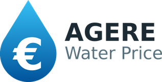

# AGERE Water Price



A Home Assistant custom integration that turns a water-meter reading (m³)
into real AGERE Doméstico (Braga) billing costs — tiered water price, fixed
availability/drainage charges, waste, government taxes, and VAT — so you can
feed accurate water costs into the HA **Energy** dashboard or your own
dashboards.

## What it does

You already have a water-meter sensor in Home Assistant reporting cumulative
consumption in m³ (e.g. a smart meter or pulse counter). AGERE's tariff isn't
a flat €/m³ price: it's a set of consumption tiers, fixed period charges,
non-taxed waste fees, and government taxes, with 6% VAT applied to some
components but not others. A single "price per m³" can't represent that.

This integration tracks your billing period (derived from the meter readings
on your invoices), computes the AGERE bill breakdown for the consumption in
the current period, and exposes it as sensors — including a running
total-cost sensor that matches what AGERE actually bills, to the cent.

## Tariff (2026 Doméstico defaults)

| Component | Value | VAT (6%) |
|---|---|---|
| Water, 0–5 m³ | 0.5080 €/m³ | yes |
| Water, 5–10 m³ | 0.6636 €/m³ | yes |
| Water, 10–15 m³ | 0.8605 €/m³ | yes |
| Water, 15–25 m³ | 1.8765 €/m³ | yes |
| Water, >25 m³ | 2.6852 €/m³ | yes |
| Water availability (fixed/cycle) | 4.8623 € | yes |
| Sanitation drainage | 0.4809 €/m³ | yes |
| Sanitation availability (fixed/cycle) | 4.8766 € | yes |
| Waste, variable | 0.0147 €/m³ | **no** |
| Waste, fixed (fixed/cycle) | 2.5257 € | **no** |
| Tax — water resources | 0.0382 €/m³ | yes |
| Tax — sanitation resources | 0.0150 €/m³ | yes |
| Tax — waste management (fixed/cycle) | 2.8821 € | **no** |

VAT (default 6%, configurable) applies to water (tiers + availability),
sanitation (drainage + availability), and the two resource taxes. It never
applies to waste (variable, fixed, or the waste-management tax) — that
exemption comes from Portuguese law (art. 2, nº2 CIVA).

The water tier *limits* (5/10/15/25 m³) are for a 30-day period and are
prorated by the length of the billing period (`round(limit × days / 30)`),
matching how AGERE bills periods that aren't exactly 30 days. On the 33-day
period above the limits become 6/11/17/28 m³ — exactly the split printed on
the invoice. The length is fixed for the whole period, never the days elapsed
so far, so `total_cost` only ever increases with consumption within a period
(resetting at each new one) and never shrinks as the period ages. Fixed
charges (availability, waste fixed, waste-management tax) are billed in full
per period, not prorated.

These are the integration's built-in *defaults* — AGERE updates its tariff
annually, so treat these values as a snapshot for 2026, not a permanent
guarantee. Per-tariff-value editing in the UI is not yet exposed (see
Limitations below); a tariff update currently requires a code change.

## Requirements

- **Home Assistant 2024.3.0 or newer.**
- A sensor reporting your water meter's **cumulative** consumption in m³.

## Installation / Deploy to Home Assistant

The integration is a **custom component** — it lives in the
`custom_components/` folder of your Home Assistant configuration directory
(the folder that contains `configuration.yaml`). Depending on your install
type that folder is typically:

- **Home Assistant OS / Supervised**: `/config`
- **Home Assistant Container (Docker)**: the host path you mounted at
  `/config`
- **Home Assistant Core (venv)**: `~/.homeassistant` (or your configured
  directory)

### Option A — HACS (recommended)

The integration is included in the **HACS default repositories**, so there is
nothing to add manually — just search for it in HACS.

**One-click:** open the integration in your Home Assistant's HACS (requires
HACS installed):

[](https://my.home-assistant.io/redirect/hacs_repository/?owner=fapgomes&repository=ha-agere-price-calculator&category=integration)

Then click **Download**, and **restart Home Assistant**.

Or manually:

1. Open **HACS** in Home Assistant.
2. Search for "AGERE Water Price" and open it.
3. Click **Download**.
4. **Restart Home Assistant** (Settings → System → Restart).

<details>
<summary>Optional — add as a custom repository</summary>

Only needed if your HACS hasn't picked up the default repository list yet, or
if you want to track a branch other than the released versions:

1. In HACS, open the overflow menu (⋮) → **Custom repositories**.
2. Add the repository URL
   `https://github.com/fapgomes/ha-agere-price-calculator`, category
   **Integration**, and confirm.
3. Search for "AGERE Water Price" in HACS and click **Download**.
4. **Restart Home Assistant** (Settings → System → Restart).

</details>

### Option B — Manual deploy

1. Get the files onto the HA host. Pick whichever you have:
   - the **Samba** or **Studio Code Server** / **File editor** add-on, or
   - `scp` / `rsync` over SSH, or
   - `git clone https://github.com/fapgomes/ha-agere-price-calculator` on
     the host and copy from there.
2. Copy the folder `custom_components/agere_water/` into your config
   directory so the result is:
   `<config>/custom_components/agere_water/` (it must contain
   `manifest.json`, `sensor.py`, `calculator.py`, etc.).
   Example (Core/venv):
   ```bash
   cp -r custom_components/agere_water ~/.homeassistant/custom_components/
   ```
3. **Restart Home Assistant** so it picks up the new integration.

After restarting (either option), continue with **Configuration** below to
add the integration from the UI.

## Configuration

**One-click:** start adding the integration:

[](https://my.home-assistant.io/redirect/config_flow_start/?domain=agere_water)

Or go to **Settings → Devices & Services → Add Integration**, search for
"AGERE Water Price", and pick:

- **Source entity** — the sensor providing your cumulative water-meter
  reading in m³.

That is all the setup form asks. Billing periods come from meter readings,
which you add next.

### Billing periods

AGERE does not bill on a fixed day of the month — it bills **between meter
reading dates**, and those dates drift. Three consecutive invoices gave
periods of 28, 33 and ~22 days. So each period is derived from the readings
you enter, one per invoice:

```
reading n-1           reading n
2026-07-10 (512 m³)   2026-08-12 (536 m³)
     └──── period: 2026-07-11 → 2026-08-12 = 33 days, 24 m³ ────┘
```

The tier limits are prorated by that length, which is what makes the total
match the invoice to the cent.

#### Where to find the values on your invoice

Only two numbers per invoice, plus one optional date. On page 2 of the AGERE
`Documento de Pagamento`:

```
Fatura FAC 02104220xx/00xxxxxxxx
Data de Fatura         2026-08-13      ← NOT this one
Período                2026-07-11 ~ 2026-08-12
Contador Cxxxxxxxxxx   2026-08-12      Leitura 536       Consumo 24,00 m3
                           ▲                    ▲
                          date                 m3

Comunicação de Leituras
Período de Comunicação 2026-09-02 ~ 2026-09-04
                           ▲
                   next reading date (optional)
```

| What you enter | Where it comes from | Example |
|---|---|---|
| `date` | The **`Leitura` date** = end of `Período`. **Not** `Data de Fatura`, which is usually a day later. | `2026-08-12` |
| `m3` | The `Leitura` value — the meter total, not the period's consumption. | `536` |
| next reading date | `Período de Comunicação`. Optional; pick a day inside the window. | `2026-09-03` |

Two traps, both easy to fall into:

- **`Leitura` vs `Consumo`.** The invoice prints them side by side. `m3` wants
  the cumulative meter total (`536`), never the period's usage (`24`). Enter
  consumption values and the readings stop increasing, which the integration
  rejects — or, worse, silently accepts if that month's usage happens to be
  higher than the previous month's.
- **The date.** One day off changes the period length, which can move a
  consumption tier and shift the total by more than a euro.

#### Adding your first readings

Each period needs the reading that **opens** it and the one that **closes**
it, so *n* invoices give *n−1* complete periods. To reconstruct 2 periods,
enter 3 readings.

Go to **Developer tools → Actions**, pick *AGERE Water Price: Set meter
reading*, and switch to YAML mode. Then, oldest invoice first:

```yaml
action: agere_water.set_reading
data:
  date: "2026-06-12"
  m3: 488
```

```yaml
action: agere_water.set_reading
data:
  date: "2026-07-10"
  m3: 500
```

```yaml
action: agere_water.set_reading
data:
  date: "2026-08-12"
  m3: 524
```

Every call answers with the **most recent complete period** — the one ending
at your newest reading — so after the last call you can compare it with that
invoice without leaving the page:

```yaml
cycle:
  start: "2026-07-11"
  end: "2026-08-12"
  days: 33
  consumption_m3: 24
  total: 55.82
  water: 29.53
  sanitation: 16.42
  waste: 2.88
  taxes: 4.16
  vat: 2.83
```

Finally, tell it when the current period closes, so its length is exact
rather than estimated:

```yaml
action: agere_water.set_next_reading_date
data:
  date: "2026-09-03"
```

Order does not matter: readings are sorted by date whatever sequence you enter
them in. Note that the response always describes the newest complete period,
not the one the call happened to create, and that a single reading on its own
produces no complete period yet, so the response comes back empty. To check an
older invoice, look at the `cycles` attribute of `sensor.agere_last_invoice`,
which lists every period.

If you are upgrading from a version that used a reset day, the migration
leaves one reading marked `auto`, carrying the meter's own value at the old
cycle boundary (e.g. `536.61791992188`). Entering the invoice reading for
that same date replaces it and aligns the period with AGERE exactly.

#### Every month, when a new invoice arrives

Two calls, or the same thing through the UI:

```yaml
action: agere_water.set_reading
data: {date: "2026-09-03", m3: 540}      # closes the period
```
```yaml
action: agere_water.set_next_reading_date
data: {date: "2026-10-02"}               # opens the next one
```

The closed period then shows up in `sensor.agere_last_invoice`, whose
`cycles` attribute keeps every period reconstructed so far.

#### Editing readings in the UI

**Settings → Devices & Services → AGERE Water Price → Configure →
Readings.** The dropdown lists what is stored, each row annotated with the
period it produces:

```
2026-08-12 · 524 m³ · 33 d · 24 m³
2026-07-10 · 500 m³ · 28 d · 12 m³
2026-06-12 · 488 m³
➕ New reading
```

Pick a row to change its date or value, or tick **Delete this reading**. This
works for past months too: a reading's date is the boundary between two
periods, so changing it recomputes both sides.

Two rules are enforced, and a violation is shown in the form without saving
anything: dates must stay in order, and meter values must never decrease.

#### Actions reference

| Action | Fields | Notes |
|---|---|---|
| `agere_water.set_reading` | `date` (required), `m3` (optional) | Adds a reading, or replaces the one with that date. Omit `m3` and the value is read from the source sensor's recorded history for that day; supply it to match AGERE exactly, or when the history does not reach that far back. Returns the recomputed period. |
| `agere_water.remove_reading` | `date` (required) | Deletes that reading. The two periods around it merge into one. |
| `agere_water.set_next_reading_date` | `date` (optional) | Sets when the current period closes. Leave `date` out to clear it and go back to estimating from the previous period. |

All three accept an optional `config_entry`, needed only if you run more than
one AGERE entry.

### Options

Available via **Configure → Charges and VAT** on the integration entry:

- **Enable water / sanitation / waste / taxes** — independent toggles for
  each tariff component; disabled components are excluded from the total
  and from VAT.
- **Include VAT** — toggle VAT on or off.
- **VAT rate** — default `0.06` (6%).

## Sensors

| Entity ID | Description |
|---|---|
| `sensor.agere_total_cost` | Running total cost (EUR) for the current billing period — all enabled components plus VAT. Attributes include the base (pre-VAT), the VAT amount, period consumption, each component's cost, and the period itself: `cycle_start`, `cycle_end`, `billing_days`, `billing_days_estimated`, `cycle_overdue`, `next_reading_date`. |
| `sensor.agere_marginal_price` | Cost of the next cubic metre (EUR/m³) at the current point in the cycle — the active water tier's rate plus any enabled variable components and VAT. |
| `sensor.agere_cycle_consumption` | Consumption (m³) accumulated so far in the current billing cycle. |
| `sensor.agere_water_cost` | Water sub-cost (tiers + availability), when water is enabled. |
| `sensor.agere_sanitation_cost` | Sanitation sub-cost (drainage + availability), when sanitation is enabled. |
| `sensor.agere_waste_cost` | Waste sub-cost (variable + fixed, never VAT), when waste is enabled. |
| `sensor.agere_taxes_cost` | Government-taxes sub-cost, when taxes is enabled. |
| `sensor.agere_forecast` | Projected total (EUR) for the period in progress, once it closes. Attributes: `projected_m3`, `metered_m3`, `days_elapsed`, `days_remaining`, `current_daily_m3`, `historical_daily_m3`, `weight_on_current_rate`, `periods_in_history`. Diagnostic entity. |
| `sensor.agere_last_invoice` | Total (EUR) of the most recent **closed** billing period. Attributes list every derived period (start, end, days, m³, total) and the reading log itself. Diagnostic entity. |

Per-component sensors are only created for components that are enabled in
the options.

### How the forecast is projected

Extrapolating from the period's own rate is unusable in its first days — on day
one a single heavy day dominates and the forecast is nonsense. Extrapolating from
history alone ignores what is actually happening now. So the two are blended,
weighted by how far into the period you are:

```
projected m³ = metered so far + days remaining × historical daily rate
```

That is the blend written out: weighting the period's own rate by how far in you
are, and history by the rest, simplifies to exactly this. On day one the
projection is essentially the historical average; on the last day it is exactly
what the meter shows; in between it moves only when a day's use differs from the
average.

`days remaining` is continuous, not a whole-day count — with an integer the
projection would drop by a full day of historical consumption the instant the
date changed, about 0.70 € on a typical period. The historical average is total m³ over total days across every
closed period, so a long period weighs more than a short one. The projection is
never allowed to fall below what the meter already shows.

With no closed period to learn from, the projection falls back to the current
rate alone, and `historical_daily_m3` reads `null`.

The forecast is a projection of *consumption*; the cost is then computed by the
same engine as any other period, so the tier proration and the fixed charges are
handled identically.

## Energy dashboard

In **Settings → Dashboards → Energy → Water consumption**, add your
meter source, then choose **"Use an entity tracking the total costs"** and
select `sensor.agere_total_cost`.

`sensor.agere_marginal_price` is also offered as a "current price" option,
but it is only an incremental approximation of the active water tier — it
does **not** include the fixed availability/waste/tax charges billed per
cycle. Prefer `sensor.agere_total_cost` for accurate costs.

## Known limitations

The first billing period after installing the integration is partial: the
consumption baseline is captured at install time (or first restart), not at
the real start of your current AGERE period. **Entering the reading from your
latest invoice fixes it** — the period then starts where AGERE says it does.

Two caveats remain for the period in progress:

- Without a **next reading date**, its length is estimated from the previous
  period. The `billing_days_estimated` attribute flags this; set the next
  reading date to make it exact.
- If the period runs past its expected end with no new reading, its length
  **freezes** rather than stretching to today (flagged by `cycle_overdue`).
  Stretching it would widen the consumption tiers mid-period and make the
  running total go *down*, which the Energy dashboard would read as a meter
  replacement.

## Accuracy

The calculation engine is validated to the cent against three real AGERE
invoices:

- 28 m³ over 30 days → 71.21 € total.
- 18 m³ over 28 days → 44.21 € total (tier limits prorated to 5/9/14/23 m³
  for the 28-day period).

## License

Released under the [GNU General Public License v3.0](LICENSE).
